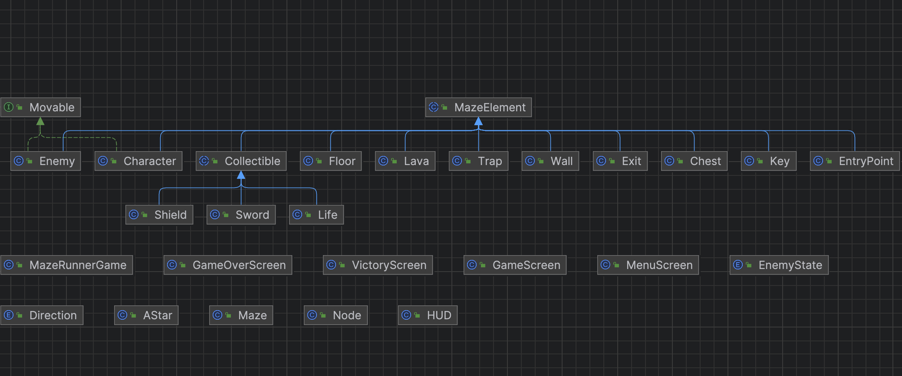

Maze Runner: Froggo's Quest

Overview

Maze Runner: Froggo's Quest is a captivating 2D top-down puzzle game developed with the libGDX framework. Dive into an adventure where Froggo, the game's protagonist, embarks on a quest to battle the forces of capitalism, represented by Oligopoly Uncles—fair-use reproductions of monopoly men with inaccuracies such as monocles. Navigate through intricately designed mazes, overcome obstacles, and help Froggo find a better life. This game features exclusive pixel artwork by Salome Tsitskishvili, commissioned specifically for this journey, bringing a unique aesthetic to Froggo's world.

Project Structure and Code Hierarchy Overview

The project is meticulously organized to showcase object-oriented programming principles, with a clear class hierarchy that supports extendability and maintainability.

Main Classes

MazeRunnerGame: The central class of the game that extends libGDX's Game class. It manages game screens, global resources like SpriteBatch and Skin, and the transition between game states.

Core Game Elements

Maze: Loads and parses maze layouts from properties files, translating them into a playable game world.
MazeElement: An abstract base class for all entities within the maze, providing common attributes and functionalities. Its design demonstrates inheritance and polymorphism, essential OOP concepts.
Inheritors of MazeElement Static Elements: Wall, Floor, EntryPoint, and Exit. These classes represent non-movable parts of the maze, each with specific roles and representations.
Dynamic Elements: Enemy and Character, implementing the Movable interface, showcasing an OOP practice of defining common behavior through interfaces.
Obstacles and Items: Trap, Key, Lava, and collectibles like Life, Shield, and Sword. These classes enrich the game's interactivity and challenges, inheriting from MazeElement or Collectible.

Utility and Support Classes

AStar: Implements the A* pathfinding algorithm, allowing enemies to intelligently navigate the maze.
Enums: Direction and EnemyState define movement directions and enemy behaviors, illustrating the use of enumerations to manage states and options.

Game Flow and Screens

Screens: GameScreen, GameOverScreen, and VictoryScreen manage different game views and states, from active gameplay to showing game over and victory messages.
HUD: Displays game status information, such as lives count and key possession, in real-time.

Pathfinding and AI

Node: Supports the A* algorithm by representing each cell in the maze for path calculations. Extended Mechanics Intelligent Enemies The game features Oligopoly Uncles as adversaries, envisioned as Finite State Machines. These enemies switch between two primary states:
Chasing: When Froggo enters their perimeter, they aggressively pursue him, symbolizing their relentless protection of wealth—the coin.
Patrolling: In their default state, they meander around their territory, guarding their assets. This behavior showcases the dynamic AI system designed to challenge players.

Collectibles and Interactive Elements

Mystery Chest

A standout feature is the Mystery Chest, which Froggo can open by pressing the space key. The chest randomly spawns one of the following beneficial items:
Heart: Grants Froggo an extra life, up to a maximum of 5, humorously acknowledging Froggo's limits.
Shield: Temporarily renders Froggo invincible, visually supported by a countdown timer, adding a strategic layer to gameplay.
Sword: Arms Froggo, enabling him to vanquish enemies that subsequently vanish, adding a layer of mystique. Each collectible's acquisition is accompanied by an explanatory message, enhancing player understanding and engagement. The shield's visible timer provides critical feedback on its temporary nature, and the sword's visual representation in Froggo's hands emphasizes the empowerment it offers.

Nothing new or special needed to run our game but we will remind you of the initial instructions published on artemis:

Running the Game
To run Maze Runner, you will need the following setup on your system:
Java Development Kit (JDK): The game is developed in Java, so you'll need the JDK installed. We recommend using JDK 11 or newer.
Gradle: The project uses Gradle for dependency management and builds. The Gradle wrapper included in the project ensures you use the correct version.
libGDX Framework: The game is built using the libGDX framework, but you don't need to install it separately.
Gradle will handle the libGDX dependencies automatically.

Running the Game from an IDE

Import the Project: Open your IDE and import the project as a Gradle project.
Configure the Run Configuration: Ensure the run configuration uses the Gradle task :desktop:run to launch the game.
Adjust the classpath of the module to desktop.main if necessary.
Execute the Run Configuration: Use the IDE's run functionality to start the game.

Copyrights:
Jeremy Blake - Powerup! for Games Music
Jorge Hernandez - Chopsticks ♫ NO COPYRIGHT 8-bit Music for Game Over Screen
Kevin MacLeod - Pixelland ♫ NO COPYRIGHT 8-bit Music for Menu Screen
Paradise - Nash Music Library
Gvantsa and Jala
